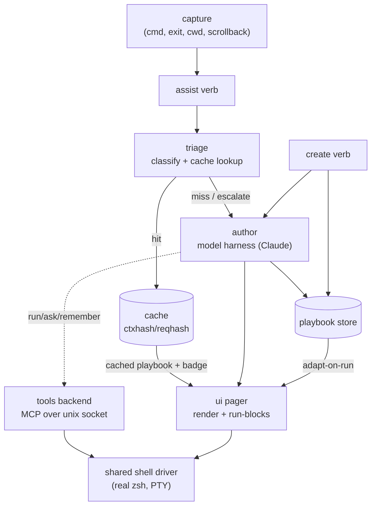

# Architecture overview

ai-playbook is a single Go binary that turns your live shell context into runnable,
reusable **playbooks** (literate-config Markdown). It has two entry verbs —
**`assist`** (triage a request, cache-served) and **`create`** (author a playbook
directly, always fresh) — and everything downstream runs **in-process** in the
same process as the pager (see [ADR-0003](adrs/0003-in-process-re-engagement.md)).

## Component flow

`assist` captures bounded origin context (last command + exit, cwd, project root,
scrollback) and runs triage: a cheap classify plus a context-hash cache lookup. A
cache hit is served straight into the pager (with the cache/regenerate badge); a
miss escalates to the author, which invokes the configured model harness and
streams the playbook into the pager as it is produced. `create` skips triage and
the cache serve entirely — it always authors fresh, then writes to both the store
and the cache. The pager (UI) renders the playbook and drives its run-blocks
against a **shared shell driver** (the user's real zsh under a PTY); on a FULL
harness the headless agent reaches its `run` / `ask` / `remember` /
`submit_playbook` tools through a **tools backend over a unix socket** that dials
back into that same driver. Produced playbooks land in the store and are adapted
to the current project on re-run.

The **harness layer** (ADR-0012) is the pluggable seam to that agent CLI: each
harness implements a 6-method capability contract — `Argv`, `Env`,
`AdapterName` (its stdout stream parser), `DisplayName`, `Capabilities`, and
`ToolTransport`, which writes the harness's own per-invocation transport
artifact (claude: an `--mcp-config` JSON pointing at the binary's MCP stdio
adapter; pi: an embedded extension that dials the socket directly) and returns
the argv that attaches it. Adapters ship in-tree, registered from their own
files, in two capability tiers: **FULL** (claude, pi — a schema-enforced tool
loop, so structured drafting and knowledge capture work) and **BASIC** (cursor
today — text-only authoring with a visible once-per-session degradation note).
Config (`[agent] harness`) only selects the harness and value preferences;
unset values resolve through a per-harness defaults table.

## Tech stack

- **Language:** Go (single statically-linked binary per platform).
- **TUI:** bubbletea / lipgloss / bubbles v2 ([charm.land](https://charm.land)),
  colorprofile.
- **Markdown + syntax:** [goldmark](https://github.com/yuin/goldmark) for parsing,
  [chroma](https://github.com/alecthomas/chroma) for highlighting.
- **Config / data:** [BurntSushi/toml](https://github.com/BurntSushi/toml) (config
  file), [gopkg.in/yaml.v3](https://gopkg.in/yaml.v3) (playbook front matter).
- **Shell driver:** [creack/pty](https://github.com/creack/pty) +
  `golang.org/x/sys`.
- **Agent tools:** the official
  [MCP go-sdk](https://github.com/modelcontextprotocol/go-sdk) (the harness
  adapter is an MCP stdio server that dials the in-process tools backend).
- **Model harness:** a pluggable agent CLI driven headless (ADR-0012) — `claude`
  (default) and `pi` at FULL tier, `cursor` at BASIC; selected by `[agent] harness`.

See the [ADRs](adrs/) for the decisions behind this shape.
